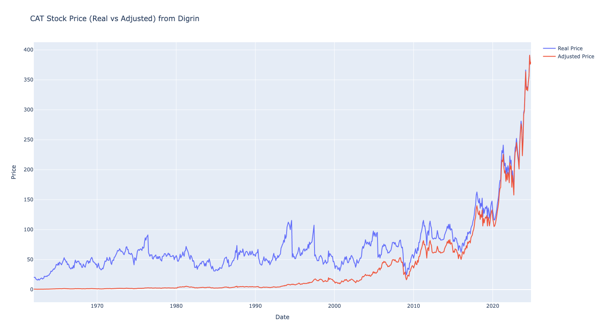

# Digrin
Data on Digrin website includes all historical data of the stock in certain categories, unlike Yahoo Finance which only provides the last 5 years of data at most. Below are some examples of the data that can be retrieved from the Digrin website.


```python
from stockdex import Ticker

ticker = Ticker(ticker="AAPL")

# Complete historical data of the stock in certain categories
dividend = ticker.digrin_dividend
payout_ratio = ticker.digrin_payout_ratio
stock_splits = ticker.digrin_stock_splits
price = ticker.digrin_price

# Non-historical data
assets_vs_liabilities = ticker.digrin_assets_vs_liabilities
free_cash_flow = ticker.digrin_free_cash_flow
net_income = ticker.digrin_net_income
cash_and_debt = ticker.digrin_cash_and_debt
shares_outstanding = ticker.digrin_shares_outstanding
expenses = ticker.digrin_expenses
cost_of_revenue = ticker.digrin_cost_of_revenue
upcoming_estimated_earnings = ticker.digrin_upcoming_estimated_earnings

# Dividend data
dividend = ticker.digrin_dividend
dgr3 = ticker.digrin_dgr3
dgr5 = ticker.digrin_dgr5
dgr10 = ticker.digrin_dgr10
```

## Plotting data:

Following functions will plot the data extracted from Digrin website using the `plotly` library:

```python
from stockdex import Ticker

ticker = Ticker(ticker="ASML")

ticker.plot_digrin_shares_outstanding()
ticker.plot_digrin_price()
ticker.plot_digrin_dividend()
ticker.plot_digrin_assets_vs_liabilities()
ticker.plot_digrin_free_cash_flow()
ticker.plot_digrin_cash_and_debt()
ticker.plot_digrin_net_income()
ticker.plot_digrin_expenses()
ticker.plot_digrin_cost_of_revenue()
```

Running each function will open a tab in default browser showing the plot. Below the output for `ticker.plot_digrin_cash_and_debt()` is illustrated for `ASML` stock:


Plots with too many data points are plotted as a line chart, instead of the default bar chart. Below is an example of a line chart for `CAT` stock historical price:

```python
from stockdex import Ticker

ticker = Ticker(ticker="CAT")

ticker.plot_digrin_price()
```

The output of the function is a line chart showing the historical price (real and adjusted) of the stock. Below is the output for `CAT` stock:

